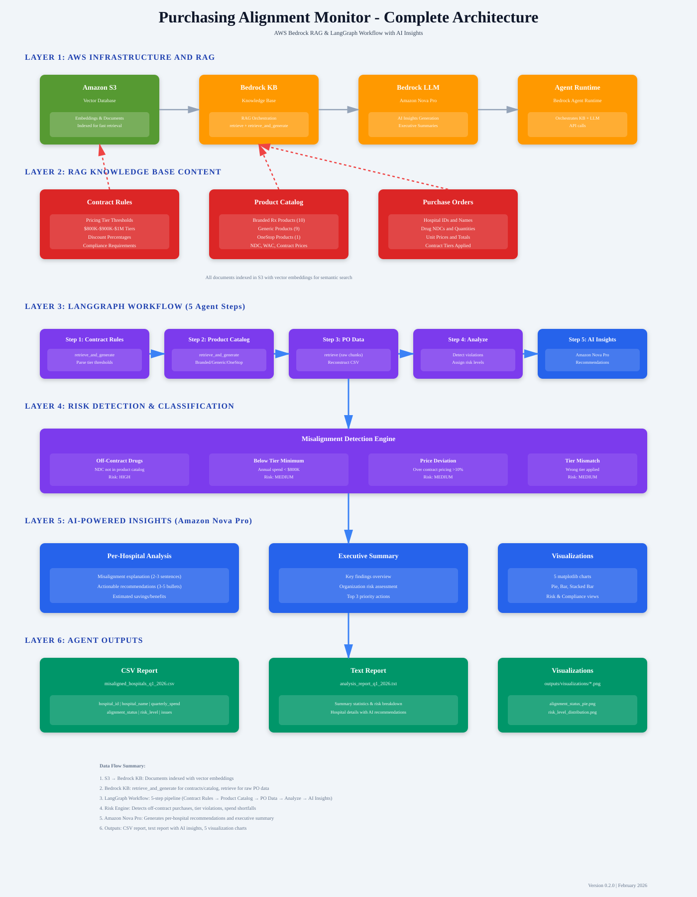

# Purchasing Alignment Monitor

AI-powered healthcare purchasing alignment monitoring system using AWS Bedrock and LangGraph.

## 🎯 Objective

Identifies hospitals whose purchasing behavior is not aligned with vendor contract rules through RAG (Retrieval-Augmented Generation).

ALL OF THE EXAMPLE DATA IS FAKE AND GENERATED BY AI

**Key Features:**
- Retrieves vendor contract rules from Bedrock Knowledge Base
- Analyzes quarterly purchase order data
- Detects purchasing misalignment patterns
- Generates risk assessments and CSV reports

## 🏗 Architecture Diagram



The workflow follows a 5-step process:

## 🏗 Project Structure

```
purchasing_alignment_monitor/
├── agents/
│   ├── retriever.py      # Bedrock KB retrieval for contracts & PO data
│   ├── analyzer.py       # Alignment analysis and risk detection
│   └── workflow.py       # LangGraph workflow orchestration
├── config/
│   └── bedrock_config.py # AWS Bedrock configuration
├── outputs/
│   └── misaligned_hospitals_*.csv  # Generated reports
└── __init__.py

main.py                    # Entry point
pyproject.toml            # Poetry dependency management
.env.example              # Environment configuration template
```

## 🔍 Alignment Analysis Logic

The system detects misaligned hospitals by analyzing:

### Detection Criteria

1. **Off-Contract Purchases** → Risk: HIGH
   - Drugs purchased that aren't in the vendor's contracted drug list

2. **Price Deviations** → Risk: MEDIUM
   - Unit prices exceed contracted rates (>10% variance)

3. **Tier Mismatches** → Risk: MEDIUM
   - Hospital using wrong contract tier classification

4. **Spend Below Minimum** → Risk: MEDIUM
   - Quarterly spend below minimum commitment threshold

### Risk Levels

- **LOW**: Minor price deviations only
- **MEDIUM**: Tier mismatch or below-minimum spend
- **HIGH**: Off-contract drug purchases or multiple violations

## 📊 CSV Output Format

**Filename:** `misaligned_hospitals_q[quarter]_[year].csv`

**Columns:**
| Column | Type | Description |
|--------|------|-------------|
| hospital_id | string | Unique hospital identifier |
| hospital_name | string | Hospital name |
| quarterly_spend | float | Total quarterly purchase spend |
| alignment_status | string | "ALIGNED" or "MISALIGNED" |
| risk_level | string | "LOW", "MEDIUM", or "HIGH" |
| issues | string | Semicolon-separated violation list |

**Example Output:**
```csv
hospital_id,hospital_name,quarterly_spend,alignment_status,risk_level,issues
HOSP001,St. Mary Medical,45000.00,MISALIGNED,HIGH,Off-contract drug: Ciprofloxacin; Below minimum spend
HOSP003,Community Health,48500.00,MISALIGNED,MEDIUM,Quarterly spend below minimum threshold
```

Only **misaligned** hospitals are included in the CSV.

## 🚀 Installation

### Prerequisites
- Python 3.10+
- Poetry
- AWS credentials with Bedrock access
- Bedrock Knowledge Base configured

### Setup

1. **Clone/Navigate to project directory**
   ```bash
   cd purchasing_alignment_monitor
   ```

2. **Create virtual environment and install dependencies**
   ```bash
   poetry install
   ```

3. **Configure environment variables**
   ```bash
   cp .env.example .env
   # Edit .env with your AWS credentials and KB ID
   ```

4. **Verify configuration**
   ```bash
   poetry run python -c "from purchasing_alignment_monitor.config.bedrock_config import bedrock_config; print(bedrock_config.validate_config())"
   ```

## 📋 Usage

### Quick Start (5 Minutes)

**Step 1: Install Dependencies**
```bash
poetry install
```

**Step 2: Configure AWS Credentials**
```bash
# Copy the environment template
cp .env.example .env

# Edit .env with your AWS details
nano .env
```

Update these values in `.env`:
```env
AWS_REGION=us-east-1
AWS_ACCESS_KEY_ID=your_actual_key
AWS_SECRET_ACCESS_KEY=your_actual_secret
KNOWLEDGE_BASE_ID=your_kb_id
MODEL_ARN=arn:aws:bedrock:us-east-1::foundation-model/amazon.nova-pro-v1:0
```

**Step 3: Run the Analysis**
```bash
poetry run python main.py
```

**Step 4: Check the Results**
```bash
# View CSV report
cat purchasing_alignment_monitor/outputs/misaligned_hospitals_q1_2026.csv

# View text report
cat purchasing_alignment_monitor/outputs/analysis_report_q1_2026.txt
```

### Run Analysis
```bash
poetry run python main.py
```

### Output Files
- **CSV Report:** `purchasing_alignment_monitor/outputs/misaligned_hospitals_q[Q]_[YEAR].csv`
- **Text Report:** `purchasing_alignment_monitor/outputs/analysis_report_q[Q]_[YEAR].txt`

### Example Output
```
================================================================================
PURCHASING ALIGNMENT MONITOR - ANALYSIS REPORT
================================================================================

Report Generated: 2025-Q1

SUMMARY
----------------
Total Hospitals Analyzed: 3
Misaligned Hospitals: 2
Alignment Rate: 33.3%

MISALIGNED HOSPITALS (HIGH RISK)
----------------

🔴 St. Mary Medical Center (ID: HOSP001)
   Risk Level: HIGH
   Quarterly Spend: $45,000.00
   Status: MISALIGNED
   Issues:
     • Off-contract drug purchased: Ciprofloxacin
     • Quarterly spend ($45,000.00) below minimum ($50,000.00)

🟡 Community Health Hospital (ID: HOSP003)
   Risk Level: MEDIUM
   Issues: Quarterly spend ($48,500.00) below minimum ($50,000.00)

================================================================================
```

## 🏗️ Workflow Architecture

### Execution Flow

```
START
  ↓
[Retrieve Contract Rules]
  │ Queries Bedrock KB for:
  │ - Contracted drug lists
  │ - Pricing tiers
  │ - Minimum commitments
  │ - Hospital classifications
  ↓
[Retrieve Purchase Order Data]
  │ Queries Bedrock KB for:
  │ - Hospital purchase records
  │ - Drug names & quantities
  │ - Prices & dates
  ↓
[Analyze Purchasing Alignment]
  │ For each hospital:
  │ - Parse purchase data
  │ - Check contract compliance
  │ - Calculate risk level
  │ - Generate findings
  ↓
[Generate CSV & Reports]
  │ Output:
  │ - misaligned_hospitals_*.csv
  │ - analysis_report_*.txt
  ↓
END
```

### LangGraph State Management

```python
WorkflowState:
  contract_rules: str
  purchase_order_data: str
  parsed_po_data: list[dict]
  hospital_analyses: list[dict]
  misaligned_hospitals: list[dict]
  csv_output: str
  report: str
```

## 🔧 Configuration

### Environment Variables (.env)

```env
# AWS Credentials
AWS_REGION=us-east-1
AWS_ACCESS_KEY_ID=your_key
AWS_SECRET_ACCESS_KEY=your_secret

# Bedrock Knowledge Base
KNOWLEDGE_BASE_ID=your_kb_id
MODEL_ARN=arn:aws:bedrock:us-east-1::foundation-model/whicheveryouwant
```

### Bedrock Knowledge Base Setup

1. Create S3 bucket with contract rules and PO data
2. Create Bedrock Knowledge Base pointing to S3
3. Configure retrieval with appropriate embeddings
4. Store Knowledge Base ID in `.env`

### Sample Contract Rules Format

```
VENDOR: PharmaCorp
Contract Rules:
- Contracted Drugs: Paracetamol, Ibuprofen, Aspirin, Amoxicillin
- Hospital Tiers: Standard (A), Advanced (B), Premium (C)
- Price Tiers:
  * Standard: Paracetamol $0.50/unit, Ibuprofen $0.75/unit
  * Advanced: Paracetamol $0.45/unit, Ibuprofen $0.70/unit
- Minimum Quarterly Commitment: $50,000
```

### Sample Purchase Order Data Format

```csv
hospital_id,hospital_name,drug_name,quantity,unit_price,total_cost,purchase_date,vendor
HOSP001,St. Mary Medical,Paracetamol,1000,0.50,500.00,2025-01-15,PharmaCorp
HOSP001,St. Mary Medical,Ciprofloxacin,200,5.00,1000.00,2025-01-20,OtherVendor
HOSP002,Riverside General,Amoxicillin,500,0.45,225.00,2025-01-10,PharmaCorp
```

## 📦 Dependencies

**Core:**
- `boto3` - AWS SDK
- `langgraph` - Workflow orchestration
- `langchain` - LLM framework
- `pydantic` - Data validation
- `pandas` - Data processing


Install all: `poetry install`

## 🧪 Testing

```bash
# Run all tests
poetry run pytest

# Run with coverage
poetry run pytest --cov=purchasing_alignment_monitor

# Run specific test file
poetry run pytest tests/test_analyzer.py -v
```

## 🐛 Troubleshooting

### AWS Authentication Error
```
Error: InvalidSignatureException
```
**Solution:** Verify AWS credentials in `.env` are correct and have Bedrock access.

### Knowledge Base Not Found
```
Error: ResourceNotFoundException
```
**Solution:** Check `KNOWLEDGE_BASE_ID` in `.env` and verify KB exists in your region.

### Missing Dependencies
```
Error: ModuleNotFoundError
```
**Solution:** Run `poetry install` to install all required packages.

### No Purchase Data Returned
```
Warning: No purchase order data to analyze
```
**Solution:** Verify Bedrock KB contains PO data in correct CSV format.

## 📈 Performance Considerations

- **Retrieval Latency:** Bedrock KB queries typically return in 2-5 seconds
- **Analysis Speed:** CSV parsing and analysis completes in <1 second for 100+ purchases
- **Scalability:** Supports unlimited hospital and purchase record analysis

